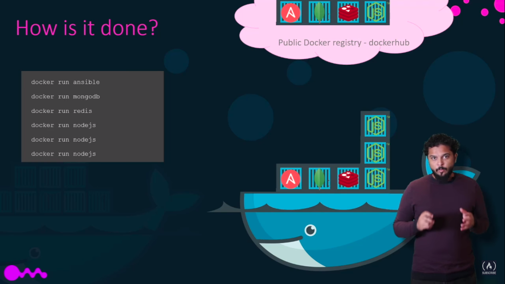
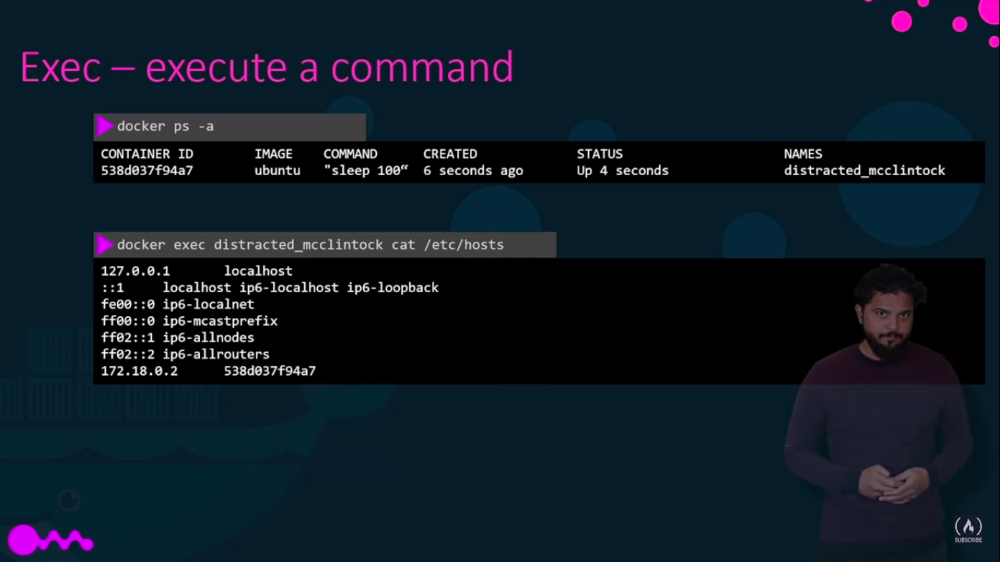
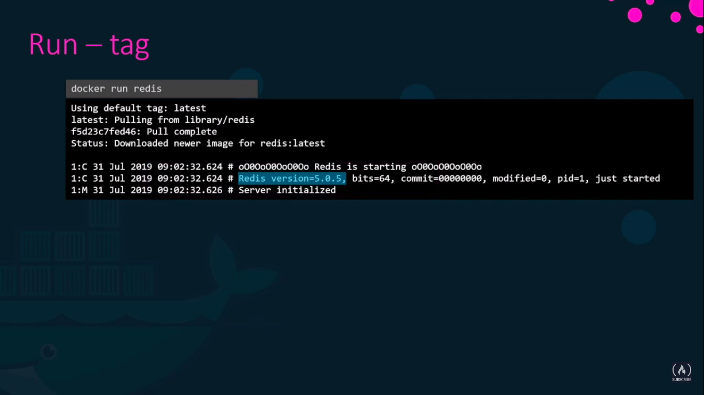
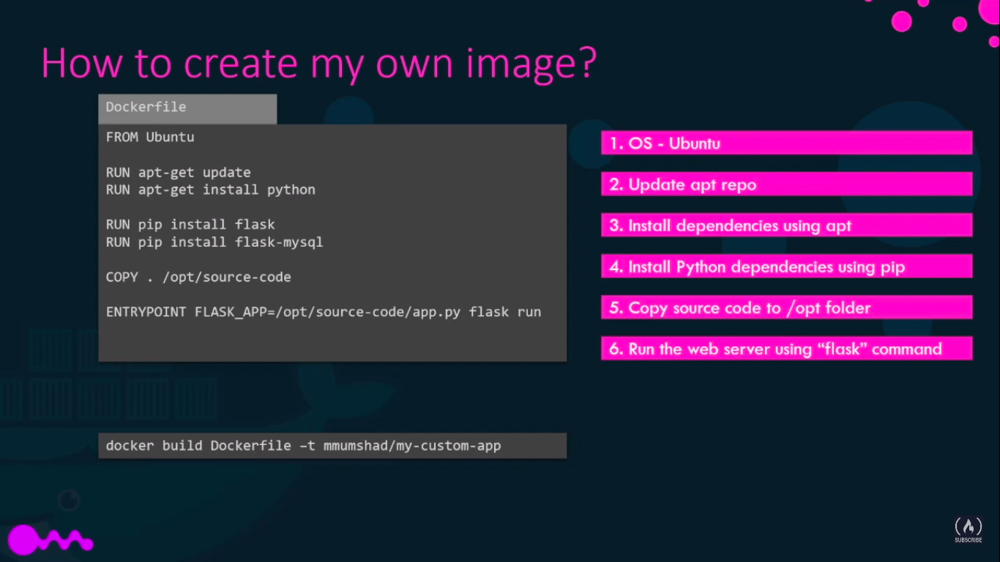

# Docker in brif or in picture 

if you wanna test your docker undrestanding so go to this web site ---> 

[Kodekloud](https://www.kodekloud.com/p/docker-labs)

there is nine labe you can practis it.

---
___

